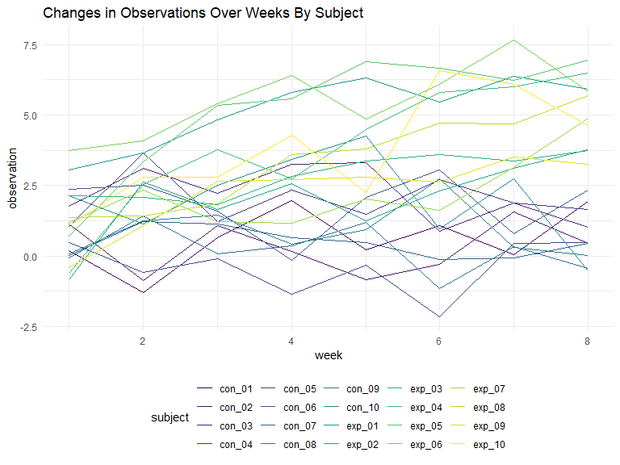

P8105\_HW\_05
================
James Ng
11/7/2019

## Problem 1

  - Problem Setup

<!-- end list -->

``` r
set.seed(10)

iris_with_missing = iris %>% 
  map_df(~replace(.x, sample(1:150, 20), NA)) %>%
  mutate(Species = as.character(Species))
```

  - function code for filling in missing values

<!-- end list -->

``` r
fill_in = function(x) {
  
  if (!is.numeric(x)) {
    replace_na(x,"virginica")
  } else if (is.numeric(x)) {
    replace_na(x,mean(x,na.rm=TRUE))
  }
  
}
```

  - map function to fill in the missing values

<!-- end list -->

``` r
iris_full=map(iris_with_missing,fill_in)
```

## Problem 2

``` r
vec_csv = str_c("./data/",list.files("./data"))
```

``` r
study_tidy = function(arm) {
  
  x = read_csv(arm)
  
  x %>% 
    janitor::clean_names() %>% 
    pivot_longer(
      week_1:week_8,
      names_to = "week",
      values_to = "observation"
      )
  
}
```

``` r
study = 
  tibble(
    vec_csv = str_c("./data/",list.files("./data"))
  ) %>% 
  mutate(
    output = map(vec_csv, study_tidy),
    vec_csv = str_remove(vec_csv,"./data/"),
    vec_csv = str_remove(vec_csv,".csv")
  ) %>% 
  unnest(output) %>% 
  #separate(vec_csv,c("arm","subject"),sep = "_",remove = TRUE) %>% 
  mutate(
    week = str_remove(week,"week_"),
    week=as.numeric(week)
  )
```

``` r
study %>% 
  #group_by(arm,subject) %>% 
  ggplot(aes(x=week,y=observation,color=vec_csv))+
  geom_line()
```


