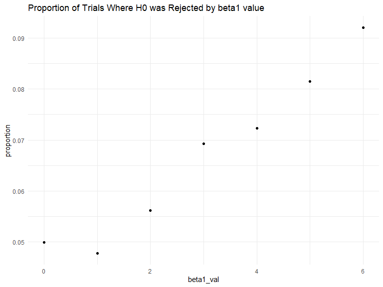
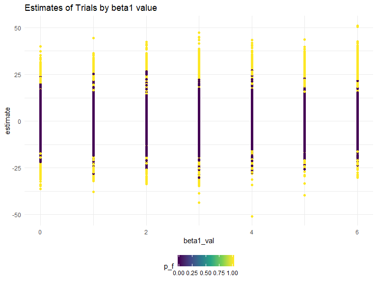
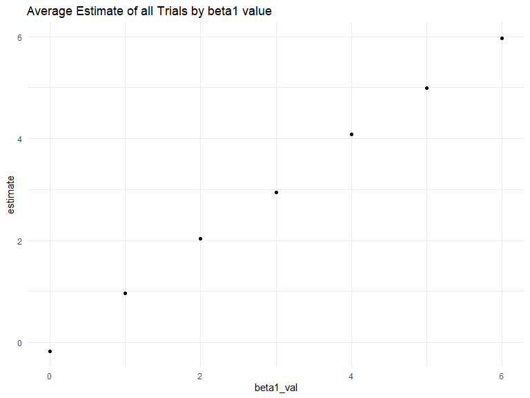
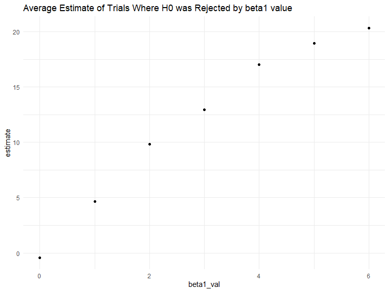

P8105\_HW\_05
================
James Ng
11/7/2019

## Problem 1

  - Problem Setup

<!-- end list -->

``` r
set.seed(10)

iris_with_missing = iris %>% 
  map_df(~replace(.x, sample(1:150, 20), NA)) %>%
  mutate(Species = as.character(Species))
```

  - function code for filling in missing values

<!-- end list -->

``` r
fill_in = function(x) {
  
  if (!is.numeric(x)) {
    replace_na(x,"virginica")
  } else if (is.numeric(x)) {
    replace_na(x,mean(x,na.rm=TRUE))
  }
  
}
```

  - map function to fill in the missing values

<!-- end list -->

``` r
iris_full=map(iris_with_missing,fill_in)
```

## Problem 2

``` r
study_tidy = function(arm) {
  
  x = read_csv(arm)
  
  x %>% 
    janitor::clean_names() %>% 
    pivot_longer(
      week_1:week_8,
      names_to = "week",
      values_to = "observation"
      )
  
}
```

``` r
study = 
  tibble(
    subject = str_c("./data/",list.files("./data"))
  ) %>% 
  mutate(
    output = map(subject, study_tidy),
    subject = str_remove(subject,"./data/"),
    subject = str_remove(subject,".csv"),
  ) %>% 
  unnest(output) %>% 
  #separate(subject,c("group","subject")) %>% 
  mutate(
    week = str_remove(week,"week_"),
    week = as.numeric(week)
  )
```

``` r
study %>%  
  ggplot(aes(x=week,y=observation,color=subject))+
  geom_line()+
  labs(
    title = "Changes in Observations Over Weeks By Subject")
```


This plot makes it hard to separate the groups to see the trends so I
faceted the plot into the two arms.

``` r
study2=study %>% 
  mutate(
   arm=subject,
  ) %>% 
  separate(arm,"arm",sep = "_")
  
study2 %>%  
  ggplot(aes(x=week,y=observation,color=subject))+
  geom_line()+
  facet_grid(~arm)+
  labs(
    title = "Changes in Observations Over Weeks By Subject and Group")
```


This chart lets us see that the experimental arm’s observational data is
increasing in value over the weeks whereas the values are mostly
constant in the control arm. We do not know what the data describes so
we cannot determine if this is a good change or not.

## Problem 3

``` r
set.seed(1)

sim_regression = function(n=30, beta0 = 2, beta1 = 0) {
  
  sim_data = tibble(
    x = rnorm(n, mean = 1, sd = 1),
    y = beta0 + beta1 * x + rnorm(n, 0, 50)
  )
  
  ls_fit = lm(y ~ x, data = sim_data)
  broom::tidy(ls_fit)
  #tibble(
  #  beta0_hat = coef(ls_fit)[1],
  #  beta1_hat = coef(ls_fit)[2]
  #)
}
```

``` r
sim_results = 
  tibble(
    beta1_val = c(0, 1, 2, 3,4,5,6)
  ) %>% 
  mutate(
    output_list = map(.x = beta1_val, ~ rerun(10000, sim_regression(beta1 = .x))),
    output_df = map(output_list, bind_rows)
  ) %>% 
  select(-output_list) %>% 
  unnest(output_df)  
```

``` r
sim_mod=sim_results %>% 
  janitor::clean_names() %>% 
  filter(term=="x") %>%  
  mutate(
    p_value = round(p_value,4),
    p_f = if_else(p_value >= 0.05,0,1,missing = NULL)
  )
```

``` r
sim_mod %>% 
  group_by(beta1_val) %>% 
  summarise(proportion=sum(p_f)/10000) %>% 
  ggplot(aes(x=beta1_val,y=proportion))+
  geom_point()+
  labs(
    title = "Proportion of Trials Where H0 was Rejected by beta1 value"
  )
```



As beta1 increased, more trials rejected the null.

``` r
sim_mod %>% 
  ggplot(aes(x=beta1_val,y=estimate,color=p_f))+
  geom_point()+
  labs(
    title = "Estimates of Trials by beta1 value"
  )
```



``` r
sim_mod %>% 
  group_by(beta1_val) %>% 
  summarise(estimate=mean(estimate)) %>% 
  ggplot(aes(x=beta1_val,y=estimate))+
  geom_point()+
  labs(
    title = "Average Estimate of all Trials by beta1 value"
  )
```



``` r
sim_mod %>% 
  filter(p_f==1) %>% 
  group_by(beta1_val) %>% 
  summarise(estimate=mean(estimate)) %>% 
  ggplot(aes(x=beta1_val,y=estimate))+
  geom_point()+
  labs(
    title = "Average Estimate of Trials Where H0 was Rejected by beta1 value"
  )
```



There is linear relationship between the average beta1 values of the
trials where the null was rejected.While the trials where the null was
rejected does not approximately equal the true value of beta1, you could
potentially use this data to extrapolate beta1.
